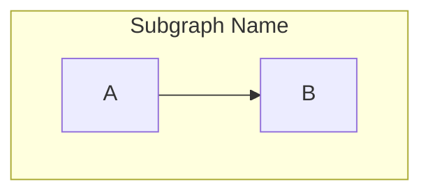

# Mermaid Flowchart Syntax Guide

## Initialization
```mermaid
flowchart TD
```
Directions:
- `TD` or `TB` - Top down
- `LR` - Left to right

## Nodes (Shapes)
- Default: `id`
- Text: `id["Text"]`
- Round edges: `id("Text")`
- Stadium: `id(["Text"])`
- Subroutine: `id[["Text"]]`
- Cylinder/Database: `id[("Database")]`
- Circle: `id(("Text"))`
- Asymmetric (Flag): `id>"Text"]`
- Rhombus (Decision): `id{"Decision"}`
- Hexagon: `id{{"Text"}}`
- Parallelogram: `id[/"Text"/]`
- Parallelogram alt: `id[\"Text"\]`
- Trapezoid: `id[/"Text"\]`
- Trapezoid alt: `id[\"Text"/]`
- Double circle: `id((("Text")))`

## Edges (Links)
- Solid link with arrow: `A --> B`
- Solid link without arrow: `A --- B`
- Text on link: `A -- "Text" --> B` or `A -->|"Text"| B`
- Dotted link with arrow: `A -.-> B`
- Dotted link with text: `A -. "Text" .-> B`
- Thick link with arrow: `A ==> B`
- Thick link with text: `A == "Text" ==> B`
- Multi directional arrows: `A <--> B`

## Subgraphs


## Important Safety Rules
- If a node label contains parentheses `()`, brackets `[]`, dashes `-`, or other special characters, you MUST wrap the label in double quotes: `A["Label (Info)"]`.
- Never use the word `end` in all lowercase as a node label. Use `"End"`.
- If an edge starts with an `x` or `o`, capitalize it or add a space to avoid creating a circle/cross edge (e.g. `A --- Ops`).
